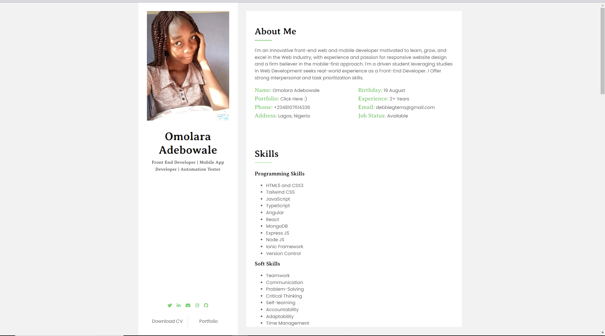
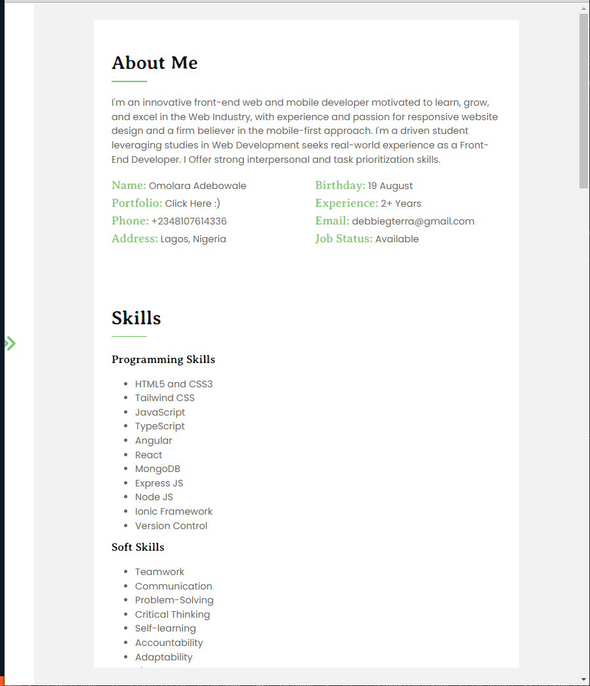
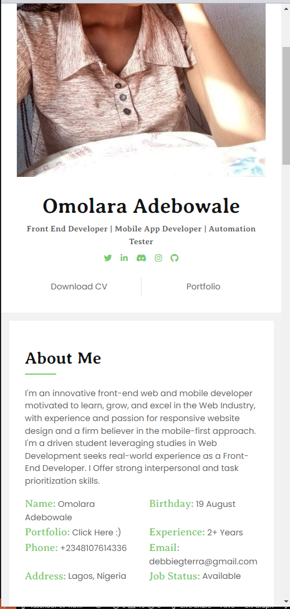

# rsschool-cv

>**My online resume website, it represents the offline version of my CV. This is one of the @rolling-scopes-school *[Javascript/Front-end Mentoring Program](https://github.com/rolling-scopes-school/js-fe-course-en)* personal tasks / projects**

## Features

- Sidebar
- Toggle Sidebar Effect on Tablet Screens
- Smooth scroll effect when portfolio is clicked
- Details About Me
- Customized Highlighted Code Sample
- Portfolio Section
- Languages Spoken Section
- Responsive Design - Can be viewed on all screen sizes (*okay not sure about Apple Watch lol*)

## Screenshots of CV

- Desktop View

  

- Tablet View

  

- Mobile View

  

## Live CV

[View live version](https://omolara5861.github.io/rsschool-cv/)

## Technologies Used

- HTML5
- CSS
- Flexbox
- Mobile First Workflow

## Challenges Faced

A major challenge I faced in this project was implementing the sidebar toggle functionality

## Part of Week 3, 4 & 5  Tasks

[CV#1. Markdown & Git](https://omolara5861.github.io/rsschool-cv/cv)

[CV#2. HTML CSS & GIT](https://omolara5861.github.io/rsschool-cv/)
